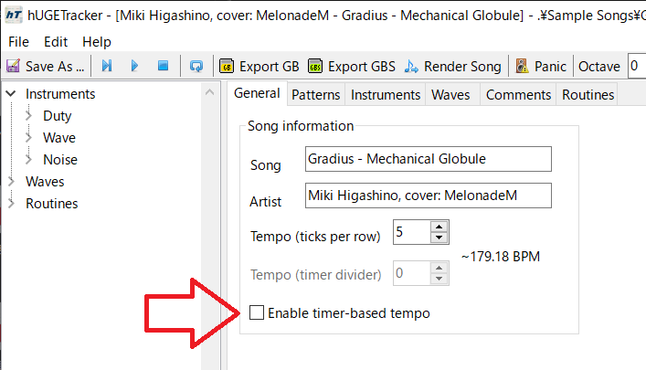

# 116_vgm2gba

File is valid only hUGETracker 1.01.

## attention

Don't use Enable timer-based tempo.

## support vga command

0x66, 0x61, 0xb3

## version

v0.02 changed timer->vblank.

v0.01 added loop function.

