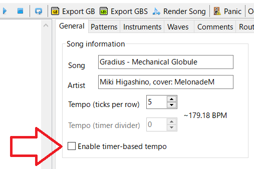

# 116_vgm2gba_vblank

2026/02/11: 

copyrat90 has developed a new VGM driver. Please use this one.

[copyrat90/advgm](https://github.com/copyrat90/advgm)

----

File is valid only hUGETracker 1.01.

## attention

Don't use Enable timer-based tempo.

## support VGM command

0x66, 0x61, 0xb3

## version

v0.03 added display filename

v0.02 changed timer->vblank

v0.01 added loop function

## Lisence

My source code(CC0)

libgba(LGPL2.0 dynamic link)

crt0.s(MPL2.0)

