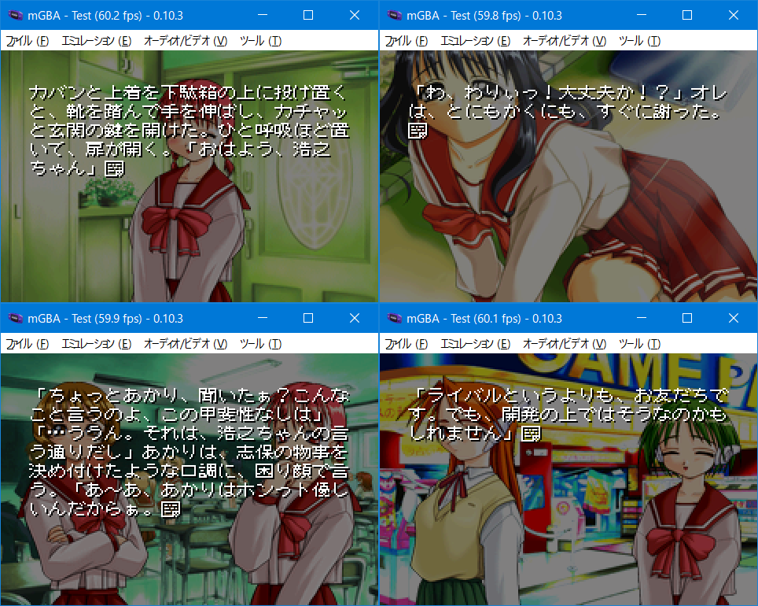

# To Heart for GBA

## ご案内

このソフトはWindows95版「To Heart」をGBA環境へ移植してみたものです。ゲームデータは付属していない為、製品版を持っている方のみ遊べます。初回版またはCDケース版を用意してください。



## 前準備

下記のファイルを「gbfs\data」内に置いてください。

```
・初回版
　LVNS3DAT.PAK 39229935バイト CRC32:9A5B220C
　LVNS3SCN.PAK  1175106バイト CRC32:206A8CE0

・CDケース版
　LVNS3DAT.PAK 39229935バイト CRC32:9A5B220C
　LVNS3SCN.PAK  1175202バイト CRC32:5196D8B9
```

## インストール環境

以下の条件で「make.bat」を実行します。

- windows 10 x64（もしくは11）
- Python3とPillowのインストール。プロンプトのパスが通っていることを確認してください
- Microsoft Visual C++ Redistributable(Visual Studio 2015, 2017, 2019, and 2022) 64bit版のインストール

変換時間はi5+SSD環境で10分ほど。約19MBのROMが作られれば成功です。ちなみにコンバート中にエラーが発生しても止まりません。やり直したい場合はDOSプロンプト画面を閉じてください。

## お約束

- 「To Heart」はアクアプラスの著作物です
- このソフトに関する問い合わせをアクアプラスにしないでください
- このソフトを使用して発生した問題など、当方は一切責任を負いません
- 利用は個人で使用する範囲に留めてください

## 謝辞

移植にあたり、さまざまなソースコードを使わせていただきました。ありがとうございます。巨人の肩の上にいる小人さん気分です。

[mglvns](https://hoshina.denpa.org/mglvns/)

大昔、自分のプログラミングパラダイムを大転換していただいたソースコードです。今読んでみると少々古臭いかもしれませんけれど、ゲーム解析をして別プラットフォームに動作させるまで至っていることを考えるとただただ畏敬の念しかありません。

[To Heart for Gameboy Color](http://mydocuments.g2.xrea.com/)

GBという少ない容量にテキスト、グラフィック、音楽を詰め込んだ作品です。職人芸という言葉では言い表せない、かなりの変態技術だと思っています。音楽は自作ドライバとGB音源の全曲集を用意しており、どれだけの時間を割いたのか戦慄してしまいます。音楽データの使用許可を頂いてGBA版にも使わせもらいました。

## 言い訳タイム！（血涙）

- GBA版は技術的に諦めたことが一杯あります。ご了承ください。
- 未解析スクリプトがいっぱいあるので挙動が違うと思います。
- 名前は固定です。
- セピア演出はありません。
- 桜は共通ルートの１回しか降りません。テキストと重なって邪魔の為。
- オープニングはタイトル画面に差し込んでないです。ストーリーに入ってます。
- カレンダーは土日でも色は変わりません。
- カレンダーは日めくりしません。
- 演出で文字の色は変わらないです。
- 歌が入っていないのにクレジットはオリジナル準拠です。ごめんなさい。
- おまけシナリオは全クリしなくても入れます。
- レミィのアレは白しかありません。
- 各バージョンのセーブデータの互換性はありません。ご注意ください。
- デフォルトのセーブ種類はSRAMです。FLASHはCUBIC STYLE製のみ対応してます。
- 感想やバグなどありましたらご[一報](https://twitter.com/akkera102)ください

## 複合イベント確認表

〇は確認済。×は見ていないというか物理の時間の前に諦めました…。エンディングは各１回それぞれ確認しています。

```
・神岸あかり　〇琴音　　　　　　　×レミィ、智子、葵
・来栖川芹香　〇マルチ　　　　　　×なし
・マルチ　　　〇芹香　　　　　　　×レミィ
・姫川琴音　　〇あかり、レミィ　　×葵
・宮内レミィ　〇琴音　　　　　　　×あかり、マルチ
・保科智子　　〇志保　　　　　　　×あかり
・長岡志保　　〇智子　　　　　　　×なし
・松原葵　　　〇あかり、琴音　　　×なし
・雛山理緒　　〇なし　　　　　　　×なし
・雅史
・おまけ
```

## クリアフラグ

クリアフラグはセーブデータのアドレス0x03と0x04に格納されています。バイナリエディタで編集することも可能です。

```
0x03フラグビット
　　0x01　あかり
　　0x02　芹香
　　0x04　智子
　　0x08　志保
　　0x10　葵
　　0x20　マルチ
　　0x40　琴音
　　0x80　レミィ

0x04フラグビット
　　0x01　雅史
　　0x02　理緒
　　0x80　おまけシナリオ
```

手っ取り早くオールクリアにしたい場合は0xFFと0x83にしてください。

## ライセンス

- 私の書いたGBAソースコード（CC0）
- libgba(LGPL2.0 dynamic link)
- crt0.s(MPL2.0)
- k12x10 font(Public domain)

## 動作環境

- mGBA 0.10.3
- GBA.emu(Android) Feb 25 2024
- EverDrive X5

## 開発環境

- windows10 pro 64bit
- devkitPro(gcc v13.2.0 devkitARM r63)
- Python3.12.3 + pillow10.3.0
- VisualBoyAdvance 1.8.0-beta 3

## 簡単な履歴

2024/10/11 v0.06
- セーブデータに効果音番号を格納していなかったフリーズバグを修正
- FLASH領域(CUBIC STYLE製カードリッジ)に書き込み不具合があった問題を修正
- msys-2.0.dll入れすぎ問題を修正

2024/02/18 v0.05
- SRAM領域外に書き込みをしていた問題を修正

2023/12/06 v0.04
- Analogue Pocket(openFPGA-GBA)でセーブできない不具合を修正

2023/09/27 v0.03 
- ゲーム開始直後にセーブ、ロードするとBGMが鳴る不具合を修正

2023/09/17 v0.02 
- レミィのアレの差分がないことをドキュメントに加筆
- ロード時に雨が降っていない不具合を修正
- オープニングアニメーション直後のログの不具合を修正
- SJISの「；」をLeafのオリジナルフォントに修正
- ハートマークのフォントを微修正
- ログ表示のハートマークの色不具合を修正
- VRAMコピーを高速化。CpuSetからCpuFastSetに変更
- 画面ズームエフェクトのチラつきを修正
- 画面ズームエフェクトの拡大率を微修正
- スライド開くエフェクトのチラつきを修正（レミィレストラン）

2023/09/10 v0.01
- とりあえず公開。長い闘いでした・・・。
- msys-2.0.dll入れすぎ問題。リリース数時間前に気がついて今更テストしなおすのも面倒になって諦めました。ごめんなさい。
