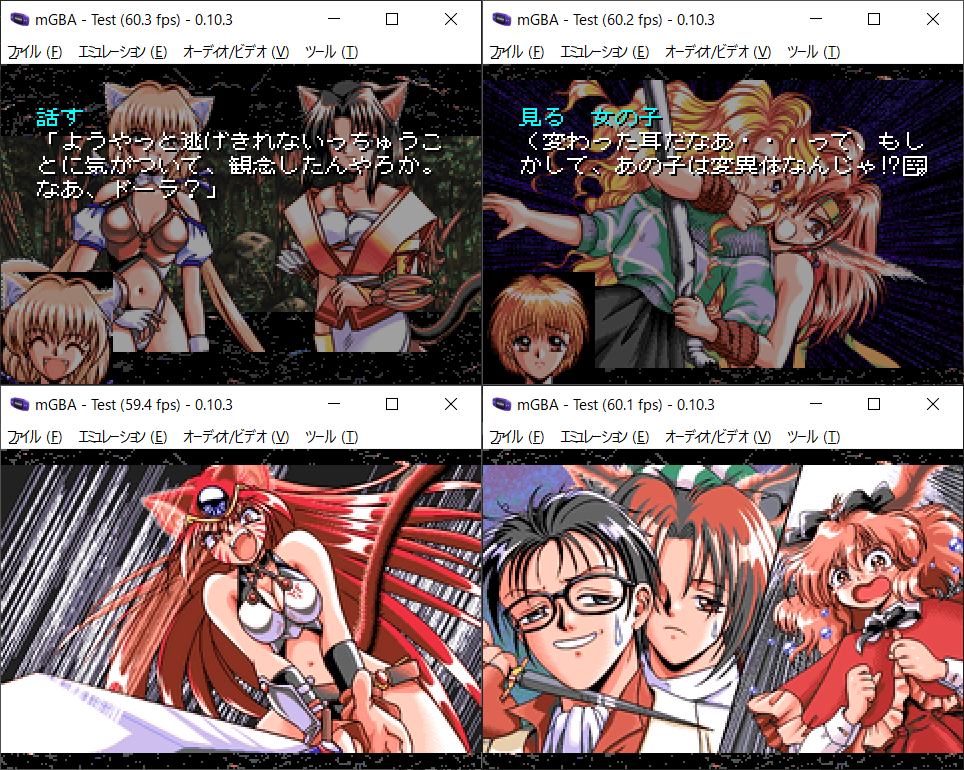

# カナン 〜約束の地〜 for GBA

## ご案内

このソフトはPC98「カナン 約束の地」をGBAへ移植したものです。ゲームデータは付属していない為、製品を持っている方のみ遊べます。フロッピーまたはCDケース版を用意してください。



## インストール方法

下記のファイルを「gbfs\data」内に置いてください。

```
DISK_A.CAT（DISK_A.LZHの中）
DISK_A.LIB（DISK_A.LZHの中）
DISK_B.CAT
DISK_B.LIB
DISK_C.CAT
DISK_C.LIB
DISK_D.CAT
DISK_D.LIB
DISK_E.CAT
DISK_E.LIB
DISK_F.CAT
DISK_F.LIB
DISK_G.CAT
DISK_G.LIB
DISK_H.CAT
DISK_H.LIB
DISK_I.CAT
DISK_I.LIB
DISK_J.CAT
DISK_J.LIB
DISK_K.CAT
DISK_K.LIB
DISK_L.CAT
DISK_L.LIB
------------
計24ファイル
```

変換作業にはPython3とPillowを使用します。別途インストールを行い、プロンプトのパスが通っていることを確認してください。「make.bat」を実行するとROMファイルが自動的に作られます。i5+SSD環境で変換時間は20-30分ほど。前編約29MB、後編約28MBのROMが作られれば成功です。ちなみにコンバート中にエラーが発生しても止まりません。やり直したい場合はDOSプロンプト画面を閉じて「gbfs\data」直下にいくつかある作業フォルダを削除してください。

## お約束

- 「カナン 約束の地」はフォア・ナインの著作物です。
- このソフトに関する問い合わせをフォア・ナインにしないでください。
- このソフトを使用して発生した問題など、当方は一切責任を負いません。
- 利用は個人で使用する範囲に留めてください。

## 謝辞

[Four･Nine System-98 ADV/Visual Novel engine](https://github.com/ValleyBell/PC98VNResearch/tree/master/four-nine_system98)

昔から移植したいと願っていたものの、廃れたハードの解析情報は一生出てこないだろうなあと諦めていた。しかし2023年9月・・・たまたま海外のDiscordサーバーを覗くとツールもあるしドキュメントも書かれている！まさに奇跡でした・・・。解析者のValley Bellさんには感謝しかありません。

[効果音](https://twitter.com/hoshi903)

hoshiさんに制作して頂きました。GB音源でFM音源を再現してもらう無茶ぶりに快く承諾してくれてとても助かっています。特に落下音がお気に入りです。ネタで作ってもらったGBA起動時の音には思わずニヤリとなるでしょう。

最後にゲームを作ってくれたフォア・ナインのスタッフ様にお礼を言わせてください。自分の中のマイベストゲームであり、エンディングを迎えた時の気持ちは生涯忘れることができません。ありがとうございます。

## （いつもの）言い訳タイム

GBAは選択肢機能を廃止して、予め出力したログを表示する作りになっています。

- 移動を省略している関係で文章上の矛盾が発生します。スルー推奨です。
- レオナH、ドーラHは1回で両方見れるように強制ルート変更しました。
- 全キャラのHシーンは全部入っています。
- パーティ表示中はメニュー画面が開けません。
- 章ジャンプはデバック用です。エンディングを見てから使用してください。
- 前編は0-17章、後編は18-28章まであります。進捗の目安にどうぞ。
- エミュで遊ぶ場合、BIOSを使ってください。オープニングで微妙にズレます。
- 各バージョンのセーブデータの互換性はありません。
- 感想やバグなどありましたらご[一報](https://twitter.com/akkera102)ください。

## 未実装

- 画面全体の振動エフェクト（小さい画面で揺れるのは・・ちょっと）
- アイコン左右移動（画面左下でチマチマアニメされても・・）
- パレット操作関連（技術的にむり・・）
- フェードウェイトの細かな調整（ログ取りしっかりしてたら取れてたかも）
- ワクワクフォア・ナイン（GBAの容量はいんない・・）
- プロローグ（GBAの容量はいんない・・泣）


## ライセンス

- 私の書いたGBAソースコード（CC0）
- カナンコンバータ関連のpythonコード、Cコード（GPL2）
- 8AD decoder engine（MIT）
- libgba(LGPL2.0 dynamic link)
- crt0.s(MPL2.0)

他にも様々なツールやコードを使わせていただきました。製作者のライセンスに従ってください。


## 動作環境

- mGBA 0.10.3
- GBA.emu(Android) Feb 25 2024
- EverDrive

実機はバッテリーがあまり持たないので注意してください。GBA SPとEverDriveの場合、稼働時間は1h18minでした。


## 開発環境

- windows10 pro 64bit
- devkitPro(gcc v13.2.0 devkitARM r63)
- Python3.12.2 + pillow10.2.0


## 簡単な履歴

2024/04/01 v0.01
・完成しました。めっちゃ難産でした。。

