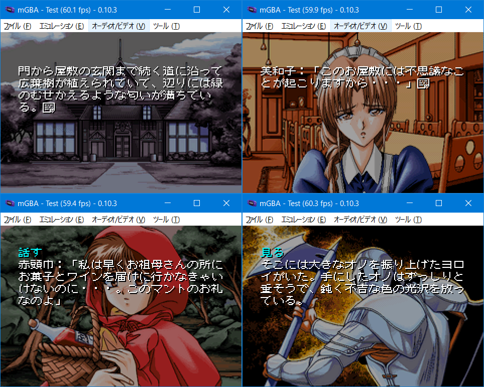

# 夢幻夜想曲 for GBA

## ご案内

このソフトはPC98「夢幻夜想曲」をGBAへ移植したものです。ゲームデータは付属していない為、製品を持っている方のみ遊べます。Windows版は申し訳ないのですが未対応です。



## インストール方法

下記のファイルを「gbfs\data」内に置いてください。

```
DISK_A.CAT
DISK_A.LIB
DISK_B.CAT
DISK_B.LIB
DISK_C.CAT
DISK_C.LIB
DISK_D.CAT
DISK_D.LIB
------------
計8ファイル
```

変換作業にはPython3とPillowを使用します。別途インストールを行い、プロンプトのパスが通っていることを確認してください。Microsoft Visual C++ Redistributable(Visual Studio 2015, 2017, 2019, and 2022)もインストールをお願いします。

「make.bat」を実行するとROMファイルが自動的に作られます。i5+SSD環境で変換時間は10分ほど。約27MBのROMが作られれば成功です。ちなみにコンバート中にエラーが発生しても止まりません。やり直したい場合はDOSプロンプト画面を閉じて「gbfs\data」直下にいくつかある作業フォルダを削除してください。なおインストーラーは32bit環境パソコンに未対応です。

## お約束

- 「夢幻夜想曲」はアプリコットの著作物です。
- このソフトに関する問い合わせをアプリコットにしないでください。
- このソフトを使用して発生した問題など、当方は一切責任を負いません。
- 利用は個人で使用する範囲に留めてください。

## 謝辞

[Four･Nine System-98 ADV/Visual Novel engine](https://github.com/ValleyBell/PC98VNResearch/tree/master/four-nine_system98)

引き続きValley Bellさんの解析ツールを使用させていただきました。夢幻夜想曲はサブルーチンスクリプトが用意されていて、エフェクト、音楽、館の見取り図表示などの役割を担当しています。シナリオスクリプトはサブルーチンを通して操作を行うので、CALL部分をフックすれば簡単に移植を進めれれます。階層構造ありがたいです。うーん・・・カナンも同じつくりだったらラクだったのにと思いましたけど、年代的にしょうがなかったのかもしれません。

効果音

引き続き[hoshiさん](https://twitter.com/hoshi903)にお願いしています。名言で使われている効果音の無茶ぶりすみませんでした。リテイクのおかげで導入部は幻想的な雰囲気になったと思います。ありがとうございます。


## 言い訳タイム（またしても・・・）

- GBA版は選択肢機能をエンディング直前まで使用しないです。その為、探索でウロウロする必要がありません。
- エンディングはオリジナルと同じく終盤まで固定です。各ヒロインのエンディングルートを選択肢一覧しています。
- 館ゲームの雰囲気を出すため1章だけは道草食わせています。部屋の名称などを確認してもらえればと思っています。
- 建物は２階建てで敷地内にも移動エリアがいくつかあります。
- 章ジャンプ（0-12）はデバック用です。エンディングを見てから使用してください。
- プレイ時間は6〜8時間程度と思われます。
- 探索は[レトロPC美少女ゲーム攻略 @ wiki](https://w.atwiki.jp/retropcgame/pages/566.html)様を参考にさせて頂きました。
- 各バージョンのセーブデータの互換性はありません。
- 感想やバグなどありましたらご[一報](https://twitter.com/akkera102)ください。

## 未実装

- エンディング画像は解析できなかったのでセピア調になりません。本編画像から似せて作りました（ぐぬぬ。


## ライセンス

- 私の書いたGBAソースコード（CC0）
- SYSTEM-98コンバータ関連のpythonコード、Cコード（GPL2）
- 8AD decoder engine（MIT）
- libgba(LGPL2.0 dynamic link)
- crt0.s(MPL2.0)

他にも様々なツールやコードを使わせていただきました。製作者のライセンスに従ってください。


## 動作環境

- mGBA 0.10.3
- GBA.emu(Android) Feb 25 2024
- EverDrive X5


## 開発環境

- windows10 pro 64bit
- devkitPro(gcc v13.2.0 devkitARM r63)
- Python3.12.3 + pillow10.3.0
- VisualBoyAdvance v1.8.0-beta3


## 簡単な履歴

2024/04/18 v0.01 初公開


