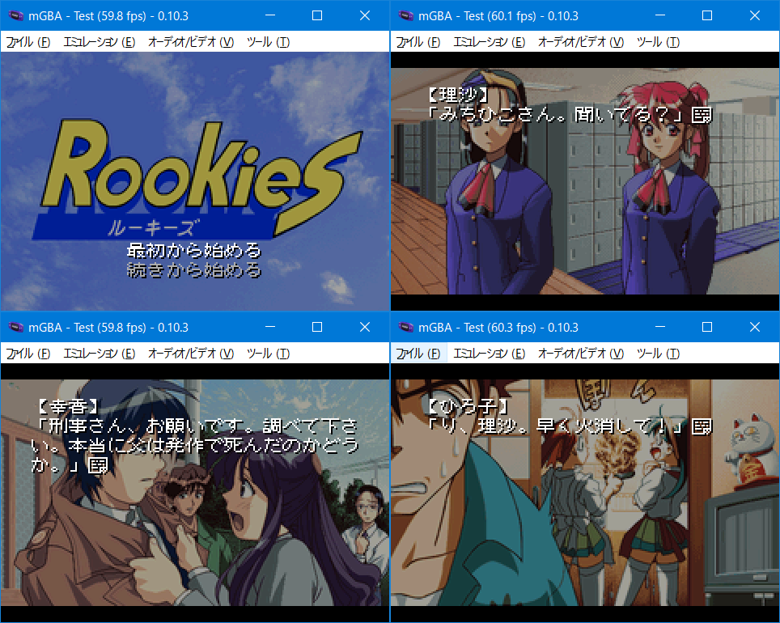

# Rookies for GBA

## ご案内

このソフトはPC98「Rookies」をGBAへ移植したものです。ゲームデータは付属していない為、製品を持っている方のみ遊べます。



## 前準備

CD-ROM版はPC98フォルダをそのまま「gbfs\data」にコピーしてください。フロッピー版はPC98フォルダを作り、各ディスクデータをその中にコピーしてください。重複ファイルは上書きして構いません。作業後は以下のフォルダ構成になると思います。

```
data/
  └ PC98/
       ├ BG/
       ├ BGM/
       ├ CHR/
       ├ ED/
       ├ ETC/
       ├ EV/
       ├ H/
       └ OP/
```

## インストール環境

以下の条件で「make.bat」を実行します。

- windows 10 x64（もしくは11）
- Python3とPillowのインストール。プロンプトのパスが通っていることを確認してください
- Microsoft Visual C++ Redistributable(Visual Studio 2015, 2017, 2019, and 2022) 64bit版のインストール

変換時間はi5+SSD環境で10-20分ほど。約30MBのROMが作られれば成功です。ちなみにコンバート中にエラーが発生しても止まりません。やり直したい場合はDOSプロンプト画面を閉じてください。

## お約束

- 「Rookies」は海月製作所の著作物です
- このソフトに関する問い合わせを海月製作所にしないでください
- このソフトを使用して発生した問題など、当方は一切責任を負いません
- 利用は個人で使用する範囲に留めてください

## 謝辞

[Xrk](http://web.archive.org/web/20011214125235/http://watasimo.pyon.org/)

XrkはX-Window + Unix Machineで動作するプログラムです。タイムスタンプを見ると1997年（27年前）となっていました（＾＾；。昔はどうやって解析したのか不明ですが、かなりの根性がないと難しいのではと思っています。今はエミュレータでシステムコール（fopen, fread）にブレイクポイントを仕掛け、そこから1GB程度のログを吐かせることが簡単にできます。エディタで全体を俯瞰することが可能です。さらにIDA Proなどを使えば関数の構造図がグラフィカルに表示させることもできます。そのようなアシストのない時代でCのコードを作り、移植するのは大変なことでは思っています。とても助かりました。

効果音(GB音源)

カナンや夢幻夜想曲に続いて[hoshiさん](https://twitter.com/hoshi903)に作って頂きました。Rookiesの効果音はけっこう量があるのですけど、一方で1回か数回程度しか使っていない音もあります。電車の踏み切り音は労力の割に一瞬だけ！涙なくして語れません。できればゆっくり聞いてほしいところです・・・。それと古い扉の開く音も個人的に気に入っています。ノベルゲームの完成度をより高く臨場感のあるものに仕上げてもらいました。

## （いつもと一味違う）言い訳タイム

素直なリソースデータやスクリプト命令だった為、原作とほぼ同じ作りになっていると自負しています。ちょっとドヤ気分です。

- GBA版は選択肢中に攻略情報を表示します。1と表示された1番目を。123なら123番目のどれかを選んでください
- 初回はトゥルーエンドを見ることをオススメします
- メニューにデバッグ項目を表示しています。エンディングを見てから使用してください
- オープニング、エンディング早送りはRキーでできます
- プレイ時間は6-8時間程度です
- 主人公の名前は固定です
- 各バージョンのセーブデータの互換性はありません
- 感想やバグなどありましたらご[一報](https://twitter.com/akkera102)ください

## ライセンス

- 私の書いたGBAソースコード（CC0）
- Rookiesコンバータ関連のpythonコード、Cコード（GPL2）
- 8AD decoder engine（MIT）
- libgba(LGPL2.0 dynamic link)
- crt0.s(MPL2.0)
- k12x10 font(Public domain)
- misaki_gothic font(see misaki.txt)

他にも様々なツールやコードを使わせていただきました。ありがとうございます。製作者のライセンスに従ってください。

## 動作環境

- mGBA 0.10.3
- GBA.emu(Android) Feb 25 2024
- EverDrive X5

## 開発環境

- windows10 pro 64bit
- devkitPro(gcc v13.2.0 devkitARM r63)
- Python3.12.3 + pillow10.3.0

## 簡単な履歴

2024/09/09 v0.01 完成しました。


