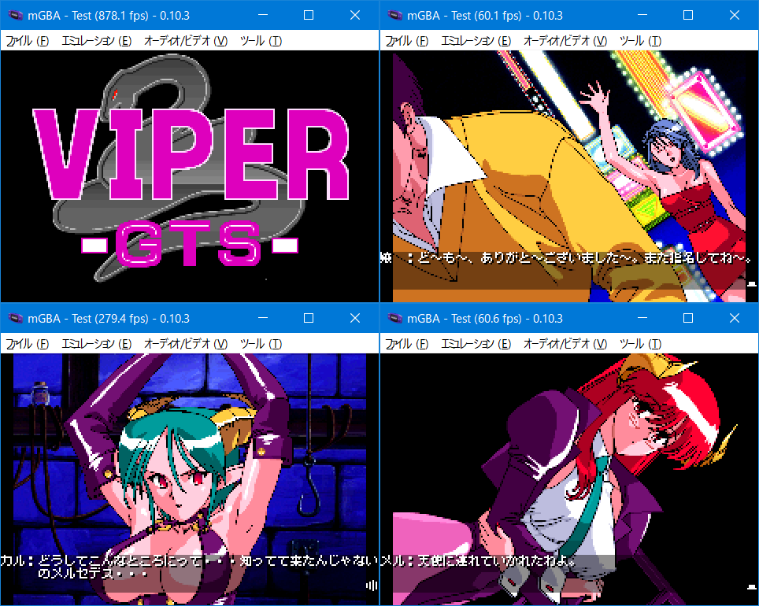

# Viper GTS for GBA

## ご案内

このソフトはWindows版「Viper GTS」をGBAへ移植したものです。ゲームデータは付属していない為、製品を持っている方のみ遊べます。



## 前準備

対応バージョンは以下の通りです。「SGS.DAT」ファイルを「gbfs\data」にコピーしてください。
```
・CDケース版（Win95）
・DVDケース版（Classic Edition）
・DLSite（ファイル容量　30.12MBと記載）　※将来変更の可能性あり 

未対応：LIMITED EDITION、PC98版、FM-TOWNS版
```

```
SGS.DAT
容量:  26273388
CRC32: 1A8782F6
```

## インストール環境

以下の条件で「make.bat」を実行します。

- windows 10 x64（もしくは11）
- Python3とPillowのインストール。プロンプトのパスが通っていることを確認してください
- Microsoft Visual C++ Redistributable(Visual Studio 2015, 2017, 2019, and 2022) 64bit版のインストール

変換時間はi5+SSD環境で15分ほど。約27MBのROMが作られれば成功です。ちなみにコンバート中にエラーが発生しても止まりません。やり直したい場合はDOSプロンプト画面を閉じてください。

## お約束

- 「Viper GTS」はソニアの著作物です
- このソフトに関する問い合わせをソニアにしないでください
- このソフトを使用して発生した問題など、当方は一切責任を負いません
- 利用は個人で使用する範囲に留めてください

## 謝辞

- 解析資料

[Notequalsoft](http://www.notequalsoft.com/)さんより提供して頂きました。具体的にはアーカイブ、スクリプト、画像、音声におけるデコード処理についてです。パッと見ただけで数か月か1年以上かかっていると思われる内容でした。ソースコードも理路整然としており大変綺麗でした。GBA移植の出発地点を大きく変えてもらいとても感謝しています。

- 音楽（ゲームボーイサウンド）

前回に続いて[Hoshi](https://twitter.com/hoshi903)さんに作って頂きました。最初、どういう方向性でリクエストすればいいかと悩んだ挙句「バブル時代のイケイケな感じで」という謎ワードが出てしまったのは笑える話です。打ち合わせの度にクオリティがアップしていて、特にエンディング曲は最高の出来栄えです。全体的にGBA版は動作が遅めの為、bpmも遅くしています。[音楽ロム](https://github.com/akkera102/gbadev-ja-test/tree/main/126_viper_gts_bgm_test)も用意していますのでぜひ聞いてください。


## （海より深い・・・）言い訳タイム

自分の技術力ではどうにもならず、妥協した作りになっています。お察しください。

- 容量増大に伴いmode3（32768色）ではなくmode4（256色）を選択しています
- 画像を単純リサイズした為、劣化が激しいです。お腹も痛いです
- 基本1枚絵をパタパタアニメをしつつ、口パクなどを別表示させてます
- 恐らくオリジナルは24fps、一方GBAは60fps。住む住民が違うのでタイミング無茶苦茶です
- レイアウトの都合上、12x10フォントをやめて8x8フォントにしました
- システムメニューを簡略化した為、セーブデータは3個のみとなっています
- 場面ジャンプを実装したのでゲームオーバー時などの巻き戻しにご利用ください
- 全ルートのプレイ時間は1時間程度です
- セーブの種類はSRAMです。FLASHはCUBIC STYLE製のみ対応しています
- 感想やバグなどありましたらご[一報](https://twitter.com/akkera102)ください

## スピーカー及びヘッドフォンモード

メニュー表示時、スタートボタンでスピーカーかヘッドフォンモードを選択できます。DMG音源のch3に働きかける機能でドラムなどの音色が変わります。お好みで使用してください。

## 場面表とフラグ

メニュー表示時、セレクトボタンでフラグ変更可能です。メルセデスフラグはルート必須、カルラフラグは小話分岐となっています。

```
・スクリプトファイル別　場面表
　　GTS0   1 -   6
　　GTS1   7 -  25
　　GTS2  26 -  39  132 136 137
　　GTS3  40 -  72  144 155 172
　　GTS4  73 - 105  175 176

　　※　+100は差分場面


・メルセデスフラグ（Ｍ）
　　書込み場面 29 48
　　　判定場面 73

・カルラフラグ（Ｃ）
　　書込み場面 51 155
　　　判定場面 70 91
```

## ライセンス

- 私の書いたGBAソースコード（CC0）
- AGSコンバータ関連のpythonコード、Cコード（GPL2）
- CULT-GBA and fixed Lorenzooone ver(MIT)
- libgba(LGPL2.0 dynamic link)
- crt0.s(MPL2.0)
- misaki TTF font(see misaki.txt)

他にも様々なツールやコードを使わせていただきました。ありがとうございます。製作者のライセンスに従ってください。

## 動作環境

- mGBA 0.10.3
- GBA.emu(Android) Apr 30 2024
- EverDrive X5
- EZ-FLASH DE

## 開発環境

- windows10 pro 64bit
- devkitPro(gcc v14.2.0 devkitARM r65)
- Python3.13.1 + pillow11.0.0
- VisualBoyAdvance 1.8.0-beta 3

## 簡単な履歴

2024/12/13 v0.01

- 完成しました


