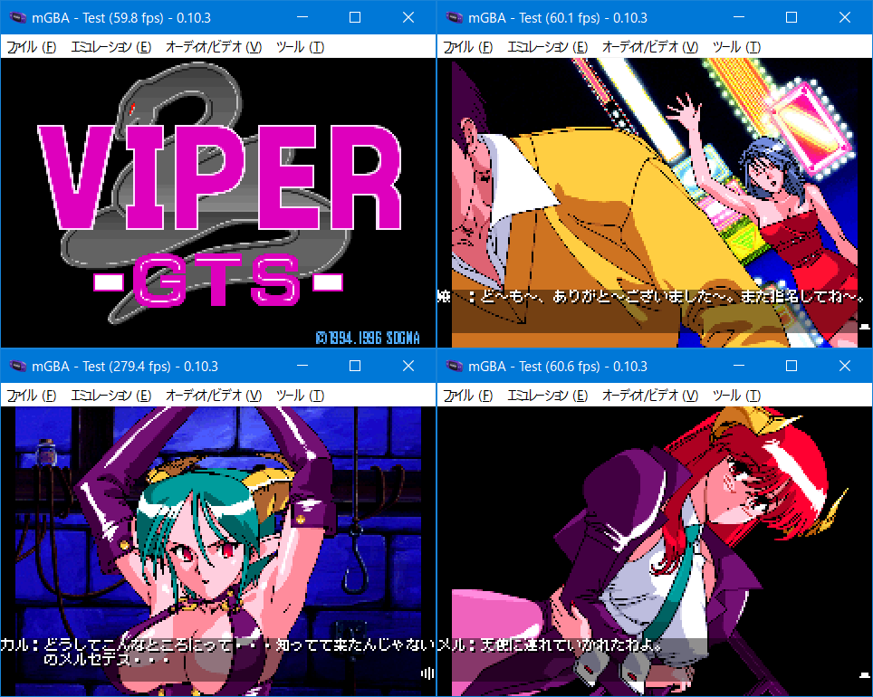

# WIP!作業中! Viper GTS for GBA

## ご案内

このソフトはWindows版「Viper GTS」をGBAへ移植したものです。ゲームデータは付属していない為、製品を持っている方のみ遊べます。



## 前準備

- 対応バージョンは以下の通りです。「SGS.DAT」ファイルを「gbfs\data」にコピーしてください。
```
〇　DLSite（ファイル容量30.12MB）　※将来変更の可能性あり 
〇　CDケース版（Win95）
〇　DVDケース版（Classic Edition）
×　LIMITED EDITION　未対応


SGS.DAT
容量:  26273388
CRC32: 1A8782F6
```

## インストール環境

以下の条件で「make.bat」を実行します。

- windows 10 x64（もしくは11）
- Python3とPillowのインストール。プロンプトのパスが通っていることを確認してください
- Microsoft Visual C++ Redistributable(Visual Studio 2015, 2017, 2019, and 2022) 64bit版のインストール

変換時間はi5+SSD環境で10-20分ほど。約27MBのROMが作られれば成功です。ちなみにコンバート中にエラーが発生しても止まりません。やり直したい場合はDOSプロンプト画面を閉じてください。

## お約束

- 「Viper GTS」はソニアの著作物です
- このソフトに関する問い合わせをソニアにしないでください
- このソフトを使用して発生した問題など、当方は一切責任を負いません
- 利用は個人で使用する範囲に留めてください

## 謝辞


## （海より深い・・・）言い訳タイム

劣化移植です、品質はお察しください。げぼば、ひでぶ、あべし！

- 容量増大に伴い、mode3（32768色）ではなくmode4（256色）を選択しています
- 画像を単純リサイズした為、劣化が激しいです。お腹も痛いです
- 基本1枚絵をパタパタアニメにしていますが、口パクなど単独で表示させました
- 恐らくオリジナルは24fps、なのにGBAは60fps。住む住民が違うでタイミング無茶苦茶です
- レイアウトの都合、12x10フォントをやめて8x8フォントにしました
- システムメニューを簡略化した為、セーブデータは３個のみです
- 場面ジャンプを実装したのでゲームオーバー時など巻き戻しにご利用ください
- BIOS入りでないと若干動作が早くなります。できれば入れて遊んでください
- 実機プレイの場合、電池の消費量が激しいです。エミュ機を推奨します
- セーブの種類はSRAMです。FLASHはCUBIC STYLE製のみ対応しています
- 全ルートのプレイ時間は1時間程度となっています
- 感想やバグなどありましたらご[一報](https://twitter.com/akkera102)ください

## 場面表とフラグ

メニュー表示時、スタートとセレクトボタンでフラグ変更可能です。メルセデスフラグは必須、カルラフラグは小話分岐となっています。

```
・場面
　　GTS0   1 -  6
　　GTS1   7 - 25
　　GTS2  26 - 39  132 136 137
　　GTS3  40 - 72  144 155 172
　　GTS4  73 -105  175 176

　　※　+100は差分場面


・メルセデスフラグ
　　書込み場面 29 48
　　　判定場面 73

・カルラフラグ
　　書込み場面 51 155
　　　判定場面 70 91
```

## ライセンス

- 私の書いたGBAソースコード（CC0）
- AGSコンバータ関連のpythonコード、Cコード（GPL2）
- libgba(LGPL2.0 dynamic link)
- crt0.s(MPL2.0)
- misaki TTF font(see misaki.txt)

他にも様々なツールやコードを使わせていただきました。ありがとうございます。製作者のライセンスに従ってください。

## 動作環境

- mGBA 0.10.3
- GBA.emu(Android) Feb 25 2024
- EverDrive X5

## 開発環境

- windows10 pro 64bit
- devkitPro(gcc v14.2.0 devkitARM r65)
- Python3.13.1 + pillow11.0.0
- VisualBoyAdvance 1.8.0-beta 3

## 簡単な履歴

2024/12/xx v0.01

- 完成しました


