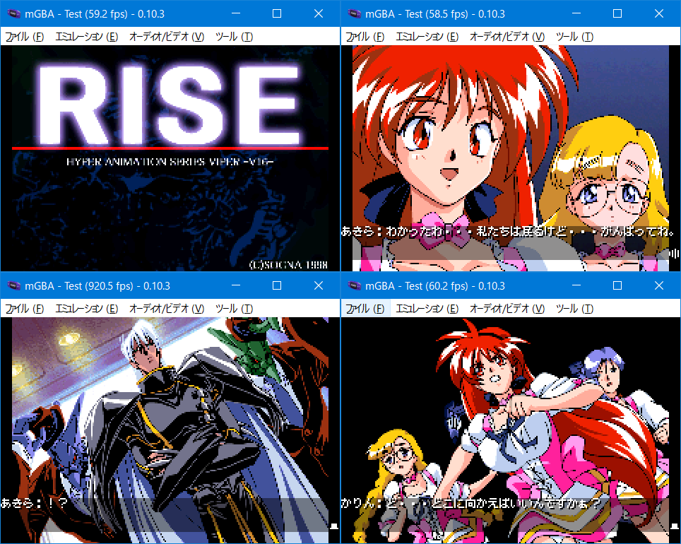

# Viper V16 RISE for GBA（現在開発中、WIP）

## ご案内

このソフトはWindows版「Viper V16 RISE」をGBAへ移植したものです。ゲームデータは付属していない為、製品を持っている方のみ遊べます。



## 前準備

対応バージョンは以下の通りです。「SGS.DAT」ファイルを「gbfs\data」にコピーしてください。
```
・CDケース版（Win95）
・DVDケース版（Classic Edition）
・DLSite（ファイル容量　24.18MBと記載）　※将来変更の可能性あり 

未対応：インターナショナル版、PC98版
```

```
SGS.DAT
容量:  27568299
CRC32: AD9053C0
```

## インストール環境

以下の条件で「make.bat」を実行します。

- windows 10 x64（もしくは11）
- Python3とPillowのインストール。プロンプトのパスが通っていることを確認してください
- Microsoft Visual C++ Redistributable(Visual Studio 2015, 2017, 2019, and 2022) 64bit版のインストール

変換時間はi5+SSD環境で15分ほど。約28MBのROMが作られれば成功です。ちなみにコンバート中にエラーが発生しても止まりません。やり直したい場合はDOSプロンプト画面を閉じてください。

## お約束

- 「Viper V16 RISE」はソニアの著作物です
- このソフトに関する問い合わせをソニアにしないでください
- このソフトを使用して発生した問題など、当方は一切責任を負いません
- 利用は個人で使用する範囲に留めてください

## 謝辞

- 解析資料

[Notequalsoft](http://www.notequalsoft.com/)さんの資料を参考にさせて頂いています。今回はGTSに続いて2回目の移植ということもあって、見晴らしよく景色を楽しむことができました。ありがとうございます。

- 音楽（ゲームボーイサウンド）


## 言い訳タイム（前回比）

作りはGTSのものを流用しています。

- 画質は256色 mode4 リサイズ1/2を採用しています。ガビガビです
- 縦スクロール操作中アニメーションするように修正しました
- 容量に余裕があったので、音声を10512Hzから16384Hzに変更しました
- バトルをスキップできる勝ち負け機能を付けました
- 全ルートのプレイ時間は1時間程度です
- セーブの種類はSRAMです。FLASHはCUBIC STYLE製のみ対応しています
- 感想やバグなどありましたらご[一報](https://twitter.com/akkera102)ください

## スピーカー及びヘッドフォンモード

セレクトボタンにてスピーカーかヘッドフォンモードを選択できます。DMG音源のch3に働きかける機能でドラムなどの音色が変わります。お好みで使用してください。

## フラグ

セレクトボタンにてフラグ変更可能です。フラグと場面の組み合わせによってはバグが発生する為、値を強制変更しています。

```
ＦＬＡＧ１
　　0:とにかく逃げる
　　1:様子を見る

　　書込み場面  5
　　　判定場面  6

ＦＬＡＧ２
　　0:２人いる
　　1:サキ捕まる
　　2:２人捕まる

　　書込み場面  8  9 15
　　　判定場面 16 22 28 29 31（16 28は戦闘後に判定）

場面22「サキ捕まる」　→　「２人いる」に変更
場面29「２人捕まる」　→　「２人いる」に変更
場面31「２人捕まる」　→　「２人いる」に変更
```

## バトルスキップ

バトル中のみ、スタートボタンにて勝ち負けスキップが可能です。

## バトル解析

攻略は以下の通りです。

```
キ:キック、パ:パンチ

手下青　　キ，パ，パ，キ
手下緑　　パ，パ，キ，パ，キ
ＢＯＳＳ　キ，パ，パ，キ，パ，キ

通常or連続攻撃どちらでも可能。
```

```
敵の行動パターンは０か１で表します。
個数は手下青４、手下緑５、ＢＯＳＳ６で各ターン１個づつ使用。

ターン　　１２３４５６７８９・・・
手下青　　０１１０
手下緑　　１１０１０
ＢＯＳＳ　０１１０１０

最大個数を超えた場合、最初から繰り返しになります。
このパターン０、１は、以下の主人公の攻撃方法で
好守が決定されます。

〇：主人公が攻撃する
×：敵が攻撃する

パターン０
　　　　　通常　連続
キック　　〇　　〇
パンチ　　×　　×
チョップ　〇　　×

パターン１
　　　　　通常　連続
キック　　×　　×
パンチ　　〇　　〇
チョップ　×　　〇

例）
手下青の２ターン目のパターンは１です。
パターン１により「通常パンチ、連続パンチ、連続チョップ」は
敵にダメージを与えます。それ以外は敵が攻撃します。

手下青の５ターン目のパターンは０です。
パターン０により「通常キック、連続キック、通常チョップ」
敵にダメージを与えます。それ以外は敵が攻撃します。
```
```
敵のダメージ
パターン０　２０
パターン１　１５


主人公のダメージ
　　　　　通常　連続
キック　　２０　４０
パンチ　　１５　３０
チョップ　１０　２０
```

## 未実装
- 場面39（オリジナル：164) の胸アニメ
- バトルの背景アニメ

## ライセンス

- 私の書いたGBAソースコード（CC0）
- AGSコンバータ関連のpythonコード、Cコード（GPL2）
- CULT-GBA and fixed Lorenzooone ver(MIT)
- libgba(LGPL2.0 dynamic link)
- crt0.s(MPL2.0)
- misaki TTF font(see misaki.txt)

## 動作環境

- mGBA 0.10.3
- GBA.emu(Android) Apr 30 2024
- EverDrive X5
- EZ-FLASH DE

## 開発環境

- windows10 pro 64bit
- devkitPro(gcc v14.2.0 devkitARM r65)
- Python3.13.1 + pillow11.0.0
- VisualBoyAdvance 1.8.0-beta 3

## 簡単な履歴

2025/0x/xx v0.01

- 完成しました


