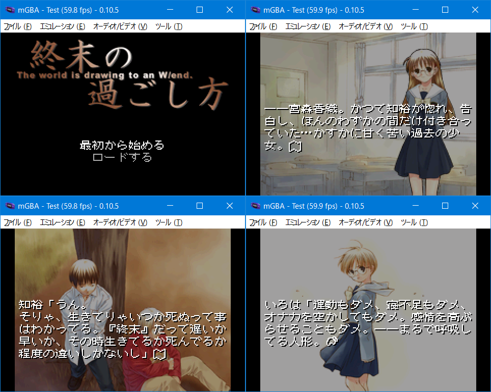

# 終末の過ごし方 for GBA

## ご案内

このソフトはWindows版「終末の過ごし方」をGBAへ移植したものです。ゲームデータは付属していない為、製品を持っている方のみ遊べます。



## 前準備

対応バージョンと必要ファイルは以下のとおりです。「gbfs\data」フォルダに入れてください。一部のadpファイルは重複して別フォルダにも存在します。同じサイズ、データですのでどちらを使用してもかまいません。
```
・DVD版
・TECH GIAN 2015年1月号
・DLSite（ファイル容量　510.55MBと記載。将来変更の可能性あり）

※ 未対応：CD版、DVD-PG版
```
```
DOM.adp

GRAPHIC.DSK
GRAPHIC.PFT

ido.adp
od_m.adp
OD_MO.adp
od_p.adp
OD_WC.adp
OD_WO.adp
paper.adp
paperbag.adp
radio.adp
radionz.adp

scene.DSK
scene.PFT

sd_m.adp
sd_p.adp
TIMEBELL.adp

WIPE.DSK
WIPE.PFT

----
計20ファイル
```

## インストール環境

以下の条件で「make.bat」を実行します。

- windows 10 x64（もしくは11）
- Python3とPillowのインストール。プロンプトのパスが通っていることを確認してください
- Microsoft Visual C++ Redistributable(Visual Studio 2015, 2017, 2019, and 2022) 64bit版のインストール

変換時間はi5+SSD環境で10分ほど。約23MBのROMが作られれば成功です。ちなみにコンバート中にエラーが発生しても止まりません。やり直したい場合はDOSプロンプト画面を閉じてください。

## お約束

- 「終末の過ごし方」はAbogado Powersの著作物です
- このソフトに関する問い合わせをAbogado Powersにしないでください
- このソフトを使用して発生した問題など、当方は一切責任を負いません
- 利用は個人で使用する範囲に留めてください

## 言い訳タイム（良い終末を）

無謀にもアルファブレンドエフェクトを使っているため、一部でお見苦しい点もあるかと思います。

- 640x480サイズを4ドット削って636x480。3で割って212x160表示にしました
- オートセーブ機能はない為、エンディング後に電源を切ると既読フラグが消えます。「最初から」を選んでセーブしてください
- オプションの「画像、音楽、効果音」は内部変数を書き換えています。不具合で停止することはありませんが場面変化するまでそのままです
- スタートボタンもしくはセレクトボタンで既読スキップ可能です
- 全ルートのプレイ時間は3時間程度になります
- セーブの種類はSRAMです。FLASHはCUBIC STYLE製のみ対応しています
- バージョンアップした場合、セーブデータに互換性はなくなります。ご了承ください
- 感想やバグなどありましたら[ご一報](https://akkera102.hatenablog.com/)願います

## 音楽担当より一言

GB音源(LSDj)版BGM制作・[テストROM(サウンドドライバ)](https://github.com/akkera102/gbadev-ja-test/tree/main/131_shuumatsu_bgm_test)開発をお手伝いしたhoshiです。RISEまではFM音源だったのでSSGの部分はGBで再現できるし何とかなる感じで作っていましたが、終末のBGMは全然違いますよね。ピアノなど特定の楽器の音色や、音数が足りない、小さな音が必要など……GB3和音で出せない音なんてのは色々あります。それらと同じ音は出せないけど、雰囲気重視でアレンジしたのが今回のGB音源版BGMです。あと、GBで曲を作っていると、特定のパターンで音が変になったりノイズが発生するなど……。ジャンルによっては“味”として残すこともありますが、ドラムなしの曲が多い終末では目立ってしまうのでなるべく抑えました。足りないなりに原曲の良さが残るよう色々な工夫したので、勝手移植と一緒に楽しんで下さい！

## ライセンス

- 私の書いたGBAソースコード（CC0）
- コンバータ関連のpythonコード、Cコード（GPL2 or later）
- Visual Novels resource browser GARbro(MIT)
- CULT-GBA and fixed Lorenzooone ver(MIT)
- libgba(LGPL2.0 dynamic link)
- gbfs(MIT)
- crt0.s(MPL2.0)

## 動作環境

- mGBA 0.10.5
- GBA.emu(Android) Apr 30 2024
- EverDrive GBA X5
- EZ-FLASH DE

## 開発環境

- windows10 pro 64bit
- devkitPro(gcc v15.1.0 devkitARM r66)
- VisualBoyAdvance 1.8.0-beta 3
- Python3.13.1 + pillow11.0.0
- MSYS2(gcc version 13.2.0)

## 簡単な履歴

2025/09/08 v0.02

- 誤検出されたファイル（kg2bmp.exe）を再コンパイル

2025/09/07 v0.01

- 完成しました
- ゲームボーイ音源全曲集を追加

2025/08/01 beta

- バグ修正

2025/07/18 beta

- おためし公開（音楽なし）
