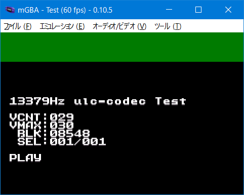

# 133_ulc-codec_test

## Link

- [ulc-codec](https://github.com/Aikku93/ulc-codec)
- [ulcplayer-gba](https://github.com/Aikku93/ulcplayer-gba)
- [ulc control code](https://github.com/neparij/katawa-shoujo-agb/blob/main/src/sound/player_ulc.iwram.c)

## lisence

My source code(CC0)

ulc-codec(Unlicense)

ulc control code(Unlicense)

CULT-GBA and fixed Lorenzooone ver(MIT)

libgba(LGPL2.0 dynamic link)

crt0.s(MPL2.0)

I got permission to use neparij's source code under "Unlicense". Thank you!
