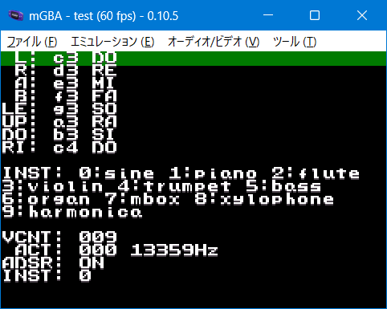

# 135_pcm_adsr_test

2026/01/10: I made a new one. Look here.

[121_lsdj_bgm_test2](https://github.com/akkera102/gbadev-ja-test/tree/main/136_pcm_adsr_test2)

----

GBA PCM Driver This oneÅfs a bit bulky. Each sample is a full second (13,359 bytes), making instrument data pretty heavy. Also, ADSR is called per data point instead of per frame.

## lisence

My source code(CC0)

CULT-GBA and fixed Lorenzooone ver(MIT)

libgba(LGPL2.0 dynamic link)

crt0.s(MPL2.0)
