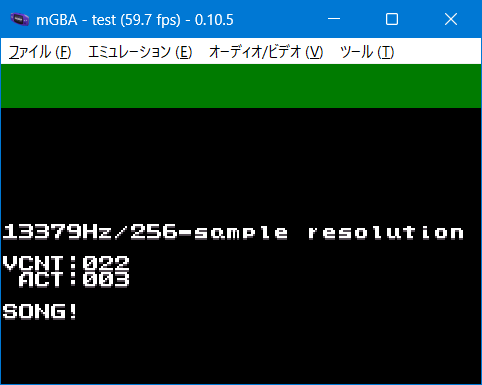
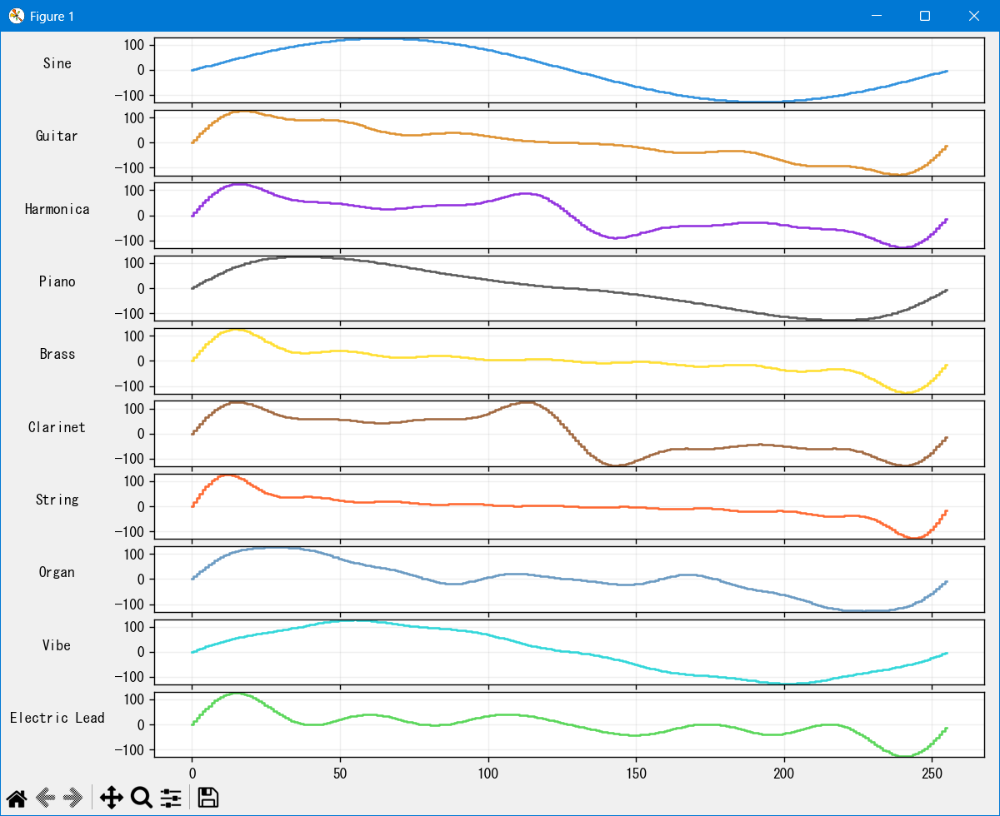

# 136_pcm_adsr_test2

I used an ADSR envelope and 256-byte sine-based tones to play guitar, organ, and more at a 13,359Hz sampling rate.

## lisence

My source code(CC0)

CULT-GBA and fixed Lorenzooone ver(MIT)

libgba(LGPL2.0 dynamic link)

crt0.s(MPL2.0)
