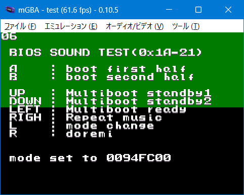

# 137_bios_snd_test

## Link

- [biossnddemo](https://github.com/ipatix/gba-template/tree/biossnddemo)
- [GBAのシステム機能で音を鳴らしてみる](https://qiita.com/_wataame/items/6f972497c5748273b3cd)

## lisence

Adapted from the libgba header, and therefore licensed under GPLv2 or later.

My source code(GPL2 or later)

CULT-GBA and fixed Lorenzooone ver(MIT)

libgba(LGPL2.0 static link)

crt0.s(MPL2.0)
