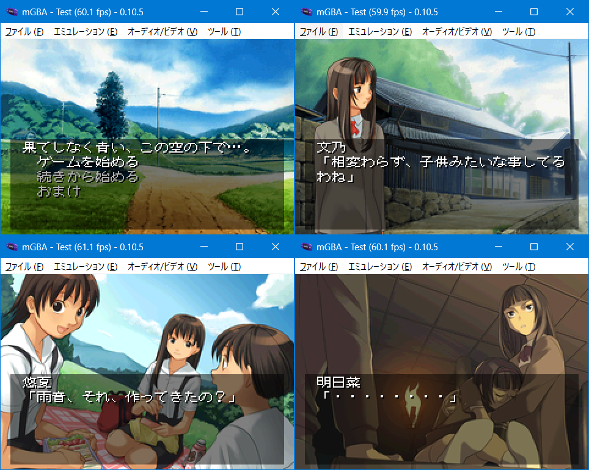

# （Work In Progress）果てしなく青い、この空の下で…。 for GBA

## ご案内

このソフトはWindows版「果てしなく青い、この空の下で…。」をGBAへ移植したものです。ゲームデータは付属していない為、製品を持っている方のみ遊べます。



## 前準備

対応バージョンと必要ファイルは以下のとおりです。
```
・初回版（通常版）
・メモリアル版
・DLSite

※ 未対応：完全版、TECH GIAN BRILLIANT 2013年 上半期
```
```
・DLsite
  「AOZORA」フォルダを丸ごと「gbfs\data」にコピーしてください。

・初回版（通常版）
・メモリアル版
  DLsiteと同様に「AOZORA」フォルダを丸ごと「gbfs\data」にコピーします。
  CDDAをリッピングして「track」フォルダを作り「track_02.wav」を配置してください。
```
作業が完了すると、以下の構成になります。
```
data/
  └ AOZORA/
       ├ BGM/
       ├ SE/
       └ track/
```

## インストール環境

以下の条件で「make.bat」を実行します。

- windows 11 x64
- Python3とPillowのインストール。プロンプトのパスが通っていることを確認してください
- Microsoft Visual C++ Redistributable(Visual Studio 2015, 2017, 2019, and 2022) 64bit版のインストール

変換時間はi5+SSD環境で15分ほど。約29.5MBのROMが作られれば成功です。ちなみにコンバート中にエラーが発生しても止まりません。やり直したい場合はDOSプロンプト画面を閉じてください。

## お約束

- 「果てしなく青い、この空の下で…。」はTOPCATの著作物です
- このソフトに関する問い合わせをTOPCATにしないでください
- このソフトを使用して発生した問題など、当方は一切責任を負いません
- 利用は個人で使用する範囲に留めてください

## 言い訳タイム（作業中〜）

- 攻略情報のナビゲートを付けました。ゲーム開始時に選んでください。ゲーム中選択外を選ぶとナビが外れます
- 既読機能にスタートボタンで高速スキップ、セレクトボタンで画面スキップを用意しました
- 全ルートのプレイ時間は20-25時間程度になります
- セーブの種類はSRAMのみを対応しています
- 感想やバグなどありましたら[ご一報](https://akkera102.hatenablog.com/)ください

## ライセンス

- 私の書いたGBAソースコード（CC0）
- コンバータ関連のpythonコード、Cコード（GPL2 or later）
- CULT-GBA and fixed Lorenzooone ver(MIT)
- ulc-codec(Unlicense)
- gbfs(MIT)
- libgba(LGPL2.0 dynamic link)
- crt0.s(MPL2.0)

## 動作環境

- mGBA 0.10.5
- GBA.emu(Android) Mar 17 2026
- EverDrive GBA X5
- EZ-FLASH DE

## 開発環境

- windows11 pro 64bit
- devkitPro(gcc v15.1.0 devkitARM r66)
- VisualBoyAdvance 1.8.0-beta 3
- Python3.13.7 + pillow11.3.0
- MSYS2(gcc version 15.2.0)

## 簡単な履歴

2026/07/03 beta

- おためし公開
