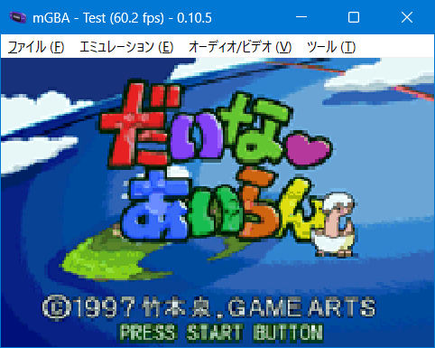

# だいなあいらん オープニングデモ for GBA

## ご案内

このソフトはセガサターン版「だいなあいらん オープニング」をGBAへ移植したものです。ゲームデータは付属していない為、製品を持っている方のみ視聴できます。



## 前準備

必要ファイルは以下のとおりです。「gbfs\data」にコピーしてください。

```
・DIN_OP.DBL
・DIN_OP00.ST2
・SPRING.GI
```

## インストール環境

以下の条件で「make.bat」を実行します。

- Windows 11 x64
- Python3とPillowのインストールされており、コマンドプロンプトでパスが通っていることを確認してください
- Microsoft Visual C++ Redistributable(Visual Studio 2015, 2017, 2019, and 2022) 64bit版のインストール

変換時間はi5+SSD環境で15分ほど。約30.6MBのROMが作られれば成功です。ちなみにコンバート中にエラーが発生しても止まりません。やり直したい場合はDOSプロンプト画面を閉じてください。

## お約束

- 「だいなあいらん」はゲームアーツの著作物です
- このソフトに関する問い合わせをゲームアーツにしないでください
- このソフトを使用して発生した問題など、当方は一切責任を負いません
- 利用は個人で使用する範囲に留めてください

## 謝辞

本技術デモは「だいなあいらんプレーヤー for Towns OS（だいなふぉとす）」のソースコードを参考にしています。素晴らしい作品から多くのことを学ばせていただきました。

## ライセンス

- 私の書いたGBAソースコード（CC0）
- コンバータ関連のpythonコード、Cコード（GPL2 or later）
- CULT-GBA and fixed Lorenzooone ver(MIT)
- 8AD decoder engine（MIT）
- gbfs(MIT)
- libgba(LGPL2.0 dynamic link)
- crt0.s(MPL2.0)

## 動作環境

- mGBA 0.10.5
- GBA.emu(Android) Mar 17 2026
- EverDrive GBA X5
- EZ-FLASH DE

## 開発環境

- Windows11 Pro 64bit
- devkitPro(gcc v15.1.0 devkitARM r66)
- VisualBoyAdvance 1.8.0-beta 3
- Python3.13.7 + pillow11.3.0
- MSYS2(gcc version 15.2.0)

## 簡単な履歴

2026/07/29 v0.02

- ソースコードの整頓（若干処理に変化あり

2026/07/27 v0.01

- とりあえず完成
- 音楽とフレームの同期を修正

2026/07/25 beta

- おためし公開
